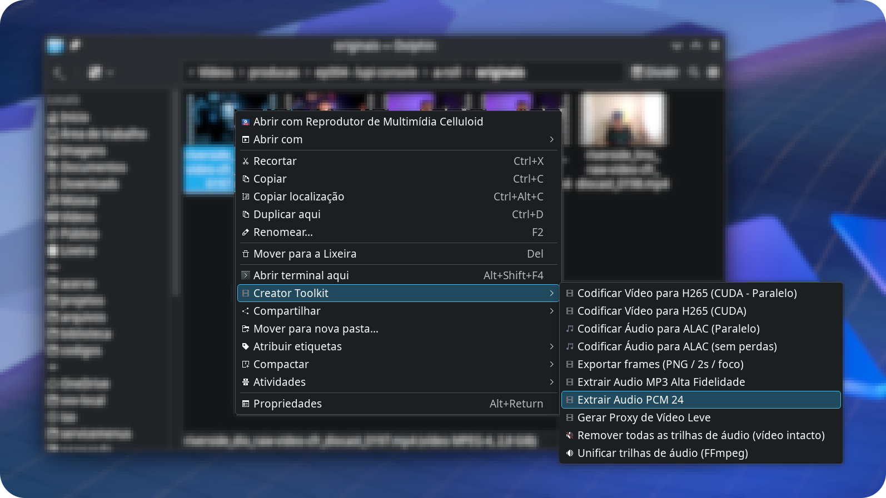

# Creator Toolkit


[](LICENSE)


Ações de produtividade para o menu de contexto do KDE Dolphin, voltadas para fluxos de áudio, vídeo, imagens e organização de projetos no Linux.

[Recursos](#recursos) · [Requisitos](#requisitos) · [Instalação](#instalação) · [Uso](#uso) · [Changelog](#changelog) · [Solução-de-problemas](#solução-de-problemas) · [Contribuição](#contribuição)

## Veja em ação



O Creator Toolkit adiciona ações personalizadas ao Dolphin usando scripts Shell e arquivos `.desktop`.

> [!IMPORTANT]
> Cada recurso é formado por um par de arquivos: o `.sh` executa a tarefa e o `.desktop` adiciona a ação ao menu do Dolphin.

> [!WARNING]
> Os arquivos originais são preservados, mas arquivos de saída com o mesmo nome podem ser sobrescritos quando o recurso for executado novamente.

## Recursos

### 🎧 Áudio

| Função | Recurso | Utilidade |
| --- | --- | --- |
| Conversão multicanal para estéreo | `convert-multichannel-to-stereo` | Converte áudio multicanal para estéreo. |
| Codificação para ALAC | `encode-audio-alac` | Converte áudio para Apple Lossless Audio Codec. |
| Codificação ALAC em paralelo | `encode-audio-alac-parallel` | Processa vários arquivos de áudio simultaneamente. |
| Extração para MP3 | `extract-audio-mp3` | Extrai o áudio de vídeos em formato MP3. |
| Extração para PCM | `extract-audio-pcm` | Extrai áudio sem compressão em PCM. |
| Remoção de faixas de áudio | `remove-audio-tracks` | Remove faixas de áudio de arquivos de vídeo. |

Cada recurso acima corresponde a dois arquivos com o mesmo nome-base:

```text
nome-do-recurso.sh
nome-do-recurso.desktop
```

### 🎬 Vídeo

| Função | Recurso | Utilidade |
| --- | --- | --- |
| Codificação H.265 com CUDA | `encode-video-h265` | Recodifica vídeos usando o encoder `hevc_nvenc` da NVIDIA. |
| Codificação H.265 em paralelo | `encode-video-h265-parallel` | Processa vários vídeos simultaneamente. |
| Geração de proxy | `generate-video-proxy` | Cria arquivos proxy para facilitar a edição. |
| Exportação de quadros | `export-focus-frames` | Exporta quadros selecionados de vídeos. |

### 🖼️ Imagens

| Função | Recurso | Utilidade |
| --- | --- | --- |
| PNG para JPEG otimizado | `convert-png-to-jpeg-optimized` | Converte PNG para JPEG e reduz o tamanho do arquivo. |

### 📁 Projetos

| Função | Recurso | Utilidade |
| --- | --- | --- |
| Estrutura de projeto | `create-project-structure` | Cria diretórios iniciais para novos projetos. |

## Requisitos

- Linux com KDE Plasma e Dolphin;
- Bash;
- FFmpeg e FFprobe;
- GNU Parallel para os recursos paralelos;
- utilitários padrão do ambiente GNU/Linux.

Para codificação H.265 com CUDA/NVENC, adicione:

- GPU NVIDIA compatível com NVENC;
- drivers NVIDIA instalados;
- FFmpeg com suporte a `hevc_nvenc`;
- `nvidia-smi` funcionando corretamente.

Verifique o encoder disponível:

```bash
ffmpeg -hide_banner -encoders | grep -E 'hevc_nvenc|h264_nvenc'
```

Em Debian e Ubuntu, instale os requisitos básicos com:

```bash
sudo apt install ffmpeg parallel
```

## Instalação

```bash
git clone https://github.com/eddiecsilva/plasma-productivity-menus.git
cd plasma-productivity-menus
chmod +x *.sh
mkdir -p ~/.local/share/kio/servicemenus
cp *.desktop ~/.local/share/kio/servicemenus/
```

Os arquivos `.desktop` precisam encontrar os scripts `.sh` no caminho definido em suas linhas `Exec`. Se necessário, ajuste esses caminhos para o local em que o repositório foi instalado.

Reinicie o Dolphin após a instalação. Se os itens não aparecerem, reinicie também a sessão do KDE Plasma.

> O diretório dos menus de serviço pode variar conforme a versão do KDE Plasma e a distribuição. Consulte a documentação do seu sistema se `~/.local/share/kio/servicemenus` não funcionar.

## Uso

1. Abra o Dolphin.
2. Selecione um ou mais arquivos.
3. Clique com o botão direito.
4. Escolha uma ação do Creator Toolkit.

As funções com `parallel` podem iniciar vários processos simultaneamente. Isso aumenta o consumo de CPU, memória e, no caso de NVENC, recursos da GPU. Muitos processos concorrentes podem saturar o encoder e reduzir o desempenho.

## Solução de problemas

### A ação não aparece no Dolphin

Confira:

- se os arquivos `.desktop` estão no diretório correto;
- se a linha `Exec` aponta para o script `.sh` correto;
- se o Dolphin foi reiniciado;
- se a sessão do KDE Plasma foi reiniciada, quando necessário.

### O script não é executado

Dê permissão de execução ao script e teste-o pelo terminal:

```bash
chmod +x nome-do-script.sh
./nome-do-script.sh arquivo-de-teste
```

Confira também as dependências:

```bash
command -v ffmpeg
command -v ffprobe
command -v parallel
```

### A janela do Konsole fecha rapidamente

Durante o debug, adicione `--keep` à linha `Exec` do arquivo `.desktop`. Isso mantém a janela aberta e permite visualizar mensagens do FFmpeg e erros:

```ini
Exec=konsole --keep -e ~/.local/share/kio/servicemenus/encode-audio-alac-parallel.sh %F
```

Remova a opção depois dos testes para retornar ao comportamento normal.

### A codificação H.265 não usa a GPU

Confirme:

```bash
nvidia-smi
ffmpeg -hide_banner -encoders | grep hevc_nvenc
```

No comando FFmpeg, `-hwaccel cuda` acelera a decodificação e `-c:v hevc_nvenc` seleciona a codificação H.265 pela GPU. A presença de CUDA no sistema não garante que o encoder NVENC esteja disponível.

## Estrutura

- `*.sh`: lógica dos recursos.
- `*.desktop`: integração com o menu do Dolphin.
- `DOCS/`: documentação complementar.
- `img/`: imagens do projeto.
- `CHANGELOG.md`: histórico de alterações.
- `LICENSE`: licença do projeto.

## Changelog

Histórico de alterações veja [`CHANGELOG.md`](CHANGELOG.md).

## Contribuição

1. Faça um fork do projeto.
2. Crie uma branch para sua alteração.
3. Implemente e teste a mudança no KDE Dolphin.
4. Atualize o README ou o `CHANGELOG.md`, quando necessário.
5. Abra um pull request descrevendo a alteração.

Ao adicionar um recurso, inclua o par `.sh` e `.desktop` correspondente.

## Licença

Consulte o arquivo [`LICENSE`](LICENSE) para conhecer os termos de uso, modificação e distribuição do projeto.
